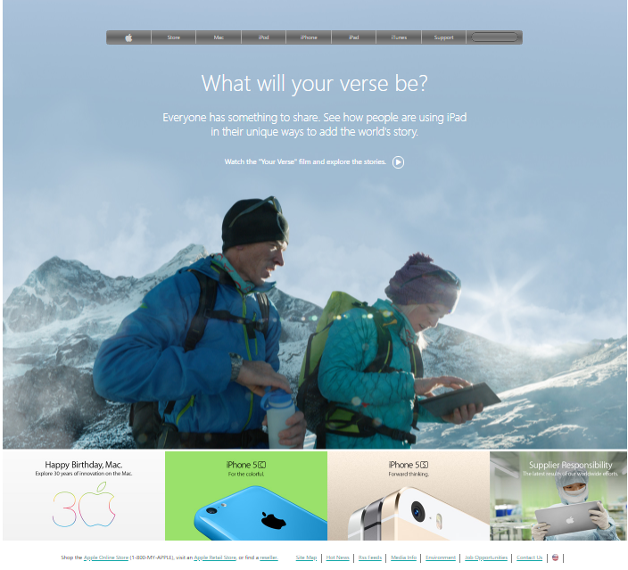

# Building-with-Backgrounds-and-Gradients

> This is a recreation of article page https://web.archive.org/web/20140301004610/http://www.apple.com/ Homepage

## Built With

- HTML5 
- CSS
- Fontawesome

## Live Demo

[Live Demo Link](https://alexoid1.github.io/Building-with-Backgrounds-and-Gradients/)

## Authors

👤 **Tadeu de Abreu Sarro**

- Github: [@tadeuasarro](https://github.com/tadeuasarro)
- Twitter: [@tadeuasarro](https://twitter.com/tadeuasarro)
- Linkedin: [@tadeuasarro](https://www.linkedin.com/in/tadeu-sarro-71481013a/)

👤 **Pablo Alexis Zambrano Coral**

- Github: [@Alexoid1](https://github.com/Alexoid1)
- Twitter: [@pablo_acz](https://twitter.com/pablo_acz)
- Linkedin: [linkedin](https://www.linkedin.com/in/pablo-alexis-zambrano-coral-7a614a189/)

## 🤝 Contributing

Contributions, issues and feature requests and any type of feedback to improve are welcome!

## Show your support

Give a ⭐️ if you like this project!

## Acknowledgments

- How to cover the whole page irrespective  of the screen size. This is a learning opportunity for you to use the background size and position properties.
- How to style a website that has more css features
- Align all elements with float and flex or grid.

## 📝 License

This project has no license.
